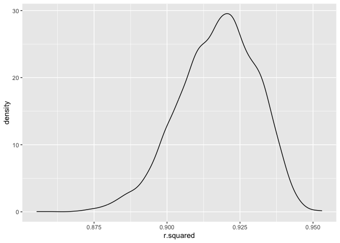
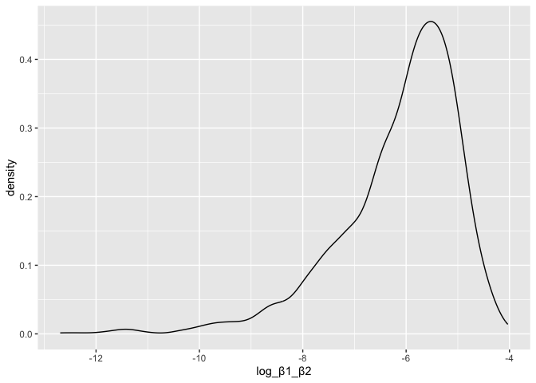
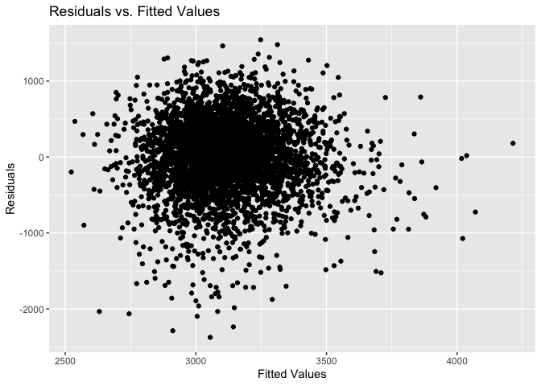
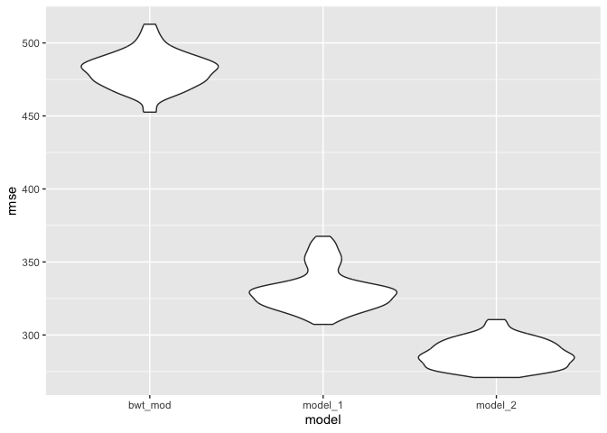

p8105_hw6_jr4392
================
Junyi Ren

``` r
library(tidyverse)
```

    ## ── Attaching core tidyverse packages ──────────────────────── tidyverse 2.0.0 ──
    ## ✔ dplyr     1.1.3     ✔ readr     2.1.4
    ## ✔ forcats   1.0.0     ✔ stringr   1.5.0
    ## ✔ ggplot2   3.4.3     ✔ tibble    3.2.1
    ## ✔ lubridate 1.9.2     ✔ tidyr     1.3.0
    ## ✔ purrr     1.0.2     
    ## ── Conflicts ────────────────────────────────────────── tidyverse_conflicts() ──
    ## ✖ dplyr::filter() masks stats::filter()
    ## ✖ dplyr::lag()    masks stats::lag()
    ## ℹ Use the conflicted package (<http://conflicted.r-lib.org/>) to force all conflicts to become errors

``` r
library(modelr)
```

## Problem 2

``` r
weather_df = 
  rnoaa::meteo_pull_monitors(
    c("USW00094728"),
    var = c("PRCP", "TMIN", "TMAX"), 
    date_min = "2022-01-01",
    date_max = "2022-12-31") |>
  mutate(
    name = recode(id, USW00094728 = "CentralPark_NY"),
    tmin = tmin / 10,
    tmax = tmax / 10) |>
  select(name, id, everything())
```

    ## using cached file: /Users/rjube/Library/Caches/org.R-project.R/R/rnoaa/noaa_ghcnd/USW00094728.dly

    ## date created (size, mb): 2023-12-01 21:46:07.009201 (8.544)

    ## file min/max dates: 1869-01-01 / 2023-11-30

``` r
weather_data_df = weather_df |>
  modelr::bootstrap(n = 5000) |>
  mutate(
    models = map(strap, \(df) lm(tmax ~ tmin + prcp, data = df) ),
    results = map(models, broom::tidy),
    rsquared = map(models, broom::glance)) |> 
  select(.id, results, rsquared) |> 
  unnest(rsquared,results) |>
  select(.id, term, estimate, r.squared) |>
   pivot_wider(
    names_from = term,
    values_from = estimate) |>
  mutate(log_β1_β2 = log(tmin * prcp)) 
```

    ## Warning: `unnest()` has a new interface. See `?unnest` for details.
    ## ℹ Try `df %>% unnest(c(rsquared, results))`, with `mutate()` if needed.

    ## Warning: There was 1 warning in `mutate()`.
    ## ℹ In argument: `log_β1_β2 = log(tmin * prcp)`.
    ## Caused by warning in `log()`:
    ## ! NaNs produced

``` r
weather_data_df |>
  ggplot(aes(x = r.squared)) + geom_density()
```

<!-- --> The
r squared has normal distribution, which centered at 0.92.

``` r
weather_data_df |>
  ggplot(aes(x = log_β1_β2)) + geom_density()
```

    ## Warning: Removed 3345 rows containing non-finite values (`stat_density()`).

<!-- --> The
log($\hat{\beta_1} * \hat{\beta_2}$) has left-skewed distribution.

``` r
ci_r_squared = quantile(pull(weather_data_df, r.squared), c(0.025, 0.975))
ci_log_β1_β2 = quantile(pull(weather_data_df, log_β1_β2), c(0.025, 0.975), na.rm = TRUE)
print(ci_r_squared)
```

    ##      2.5%     97.5% 
    ## 0.8886870 0.9397955

``` r
print(ci_log_β1_β2)
```

    ##      2.5%     97.5% 
    ## -9.047737 -4.573516

## Problem 3

``` r
birthweight = read_csv("data/birthweight.csv") |>
  janitor::clean_names() |>
  mutate( 
    babysex = 
      case_match(
        babysex, 
        1 ~ "male", 
        2 ~ "female"),
    babysex = as.factor(babysex),
    frace = 
           case_match(
             frace,
             1 ~ "White", 
             2 ~ "Black", 
             3 ~ "Asian", 
             4 ~ "Puerto Rican", 
             8 ~ "Other", 
             9 ~ "Unknown"),
         frace = as.factor(frace),
     malform = 
           case_match(
             malform,
             0 ~ "absent",
             1 ~ "present"),
         malform = as.factor(malform),
     mrace = 
           case_match(
             mrace,
             1 ~ "White", 
             2 ~ "Black", 
             3 ~ "Asian", 
             4 ~ "Puerto Rican", 
             8 ~ "Other"),
         mrace = as.factor(mrace)
  ) |>
  drop_na() |>
  select(-pnumlbw, -pnumsga)
```

    ## Rows: 4342 Columns: 20
    ## ── Column specification ────────────────────────────────────────────────────────
    ## Delimiter: ","
    ## dbl (20): babysex, bhead, blength, bwt, delwt, fincome, frace, gaweeks, malf...
    ## 
    ## ℹ Use `spec()` to retrieve the full column specification for this data.
    ## ℹ Specify the column types or set `show_col_types = FALSE` to quiet this message.

``` r
linear_mod = lm(bwt ~ ., data = birthweight)
bwt_mod = lm(bwt ~ babysex + delwt + ppbmi + ppwt + wtgain, data = birthweight)

birthweight |>
  add_predictions(bwt_mod, "predicted") |>
  add_residuals(bwt_mod, "residuals") |>
  ggplot(aes(x = predicted, y = residuals)) +
  geom_point() +
  labs(title = "Residuals vs. Fitted Values", x = "Fitted Values", y = "Residuals")
```

<!-- -->

The `linear_mod` model is a linear regression model that includes all
variables in the birthweight dataset. I set the `bwt_mod` model as
predictors that includes only a subset of variables (babysex, delwt,
ppbmi, ppwt, wtgain). The points are gatherd in the region of 2750-3500
fitted values and -1000-1000 residuals.

``` r
model_1 = lm(bwt ~ blength + gaweeks, data = birthweight)
model_2 = lm(bwt ~ bhead * blength * babysex, data = birthweight)
cv_df = 
  crossv_mc(birthweight, 100) |>
  mutate(
    train = map(train, as_tibble),
    test = map(test, as_tibble)) |>
  mutate(
    bwt_mod  = map(train, \(df) lm(bwt ~ babysex + delwt + ppbmi + ppwt + wtgain, data = df)),
    model_1  = map(train, \(df) lm(bwt ~ blength + gaweeks, data = df)),
    model_2  = map(train, \(df) lm(bwt ~ bhead * blength * babysex, data = df))) |> 
  mutate(
    rmse_bwt_mod = map2_dbl(bwt_mod, test, \(mod, df) rmse(model = mod, data = df)),
    rmse_model_1 = map2_dbl(model_1, test, \(mod, df) rmse(model = mod, data = df)),
    rmse_model_2 = map2_dbl(model_2, test, \(mod, df) rmse(model = mod, data = df)))
```

``` r
cv_df |> 
  select(starts_with("rmse")) |> 
  pivot_longer(
    everything(),
    names_to = "model", 
    values_to = "rmse",
    names_prefix = "rmse_") |> 
  mutate(model = fct_inorder(model)) |> 
  ggplot(aes(x = model, y = rmse)) + geom_violin()
```

<!-- -->
Using RMSE as a way to compare the three models, and the plot above
shows the distribution of RMSE values for each candidate model. However,
the model I set was not optimal.
